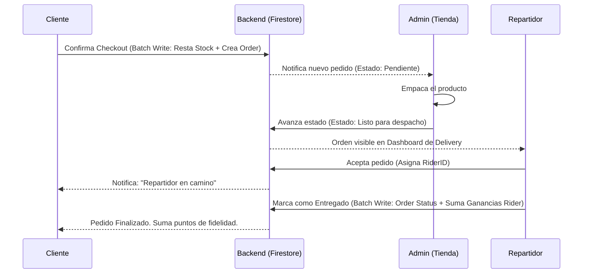

# HiBeauty

HiBeauty es una plataforma integral de **E-Commerce y Logística** especializada en productos de belleza, cuidado personal y *skincare*. Diseñada con una arquitectura moderna para dispositivos móviles Android, la plataforma no solo facilita la compra de productos, sino que unifica tres ecosistemas bajo una sola aplicación mediante gestión dinámica de roles: **Clientes, Administradores (Tienda) y Repartidores**.

---

## Índice

1. [Lógica de Negocio y Ecosistema](#lógica-de-negocio-y-ecosistema)
2. [Arquitectura y Justificación Técnica](#arquitectura-y-justificación-técnica)
3. [Stack Tecnológico](#stack-tecnológico)
4. [Modelo de Datos](#modelo-de-datos)
5. [Flujos y Diagramas (Logística)](#flujos-y-diagramas-logística)
6. [Despliegue y Configuración](#despliegue-y-configuración)
7. [Implementaciones Futuras (Roadmap)](#implementaciones-futuras-roadmap)

---

## Lógica de Negocio y Ecosistema

HiBeauty resuelve la fragmentación entre las ventas minoristas y la logística de última milla. Dependiendo del rol del usuario autenticado, la aplicación adapta completamente su interfaz y funcionalidades:

### 1. Rol: Cliente (User)
* **Retail & E-commerce:** Exploración de catálogo con filtros dinámicos (Skincare, Maquillaje, Bestsellers, Novedades).
* **Gestión de Carrito y Checkout:** Validación en tiempo real del stock de presentaciones (ej. 30ml vs 100ml) antes de generar el pedido.
* **Rutinas de Skincare (Wellness):** Un gestor de rutinas diarias donde el usuario puede registrar su progreso de autocuidado, mejorando la retención de usuarios (gamificación).
* **Historial de Pedidos:** Trazabilidad completa de las compras y su estado en tiempo real.

### 2. Rol: Administrador (Tienda)
* **Gestión de Inventario:** Creación y edición de productos, manejando múltiples presentaciones (SKUs) y precios.
* **Integración Cloudinary:** Subida optimizada de imágenes en alta resolución sin sobrecargar la base de datos principal.
* **Centro de Despacho:** Dashboard de órdenes donde se aprueban los pedidos ("Pendiente" -> "Preparando" -> "Listo"), integrándose automáticamente con la flota de repartidores.

### 3. Rol: Repartidor (Delivery)
* **Logística de Última Milla:** Dashboard exclusivo para visualizar órdenes marcadas como "Listas".
* **Asignación Dinámica:** Al aceptar un pedido, se transfiere la responsabilidad al repartidor, cambiando el estado a "En camino".
* **Liquidación de Pagos:** Cálculo automático de ganancias por entrega completada.

---

## Arquitectura y Justificación Técnica

La aplicación utiliza **MVVM (Model-View-ViewModel)** combinado con el **Patrón Repository**, diseñado estrictamente bajo los principios SOLID. 

### ¿Por qué esta arquitectura?
1. **Desacoplamiento total (Zero Firebase in Views):** Ningún Fragmento (UI) tiene conocimiento de la base de datos. Esto elimina fugas de memoria y permite realizar Unit Testing sobre la lógica de negocio sin necesitar el contexto de Android.
2. **Reactividad con StateFlow:** Los `ViewModels` exponen flujos inmutables (`StateFlow`) que la UI recolecta de manera segura respecto a su ciclo de vida (`repeatOnLifecycle`). Si el usuario rota la pantalla, no hay recargas innecesarias a la base de datos.
3. **Escalabilidad del Repository:** Al aislar Firestore y Cloudinary en Repositorios (`OrderRepository`, `ProductRepository`), podemos migrar el backend a un servidor propio (ej. Node.js + PostgreSQL) en el futuro cambiando solo esta capa, sin tocar una sola línea de UI.

---

## Stack Tecnológico

* **Lenguaje:** Kotlin 
* **UI:** XML Views + ViewBinding (Desarrollo imperativo escalado con flujos reactivos).
* **Asincronismo:** Kotlin Coroutines & Kotlin Flows (`StateFlow`, `MutableStateFlow`).
* **Inyección de Dependencias / Patrones:** Repositories inyectados vía constructores en los ViewModels.
* **Backend as a Service (BaaS):** 
  * *Firebase Auth:* Autenticación segura.
  * *Firestore:* Base de datos NoSQL en tiempo real (Atomic Batch Writes para transacciones seguras).
* **Media Management:** Cloudinary API (Gestión de recursos estáticos e imágenes).
* **Procesamiento de Imágenes:** Glide (Caché y carga asíncrona de imágenes en listas).

---

## Modelo de Datos

La estructura NoSQL en Firestore está desnormalizada estratégicamente para favorecer lecturas rápidas:

```text
Firestore Database
 |- users
 |  |- {uid} -> (Role, Name, Phone, Address, Earnings, Points)
 |     |- routine -> (Subcolección gamificada de pasos diarios)
 |- products
 |  |- {productId} -> (Name, Category, ImageUrl)
 |     |- presentations (Map: { "30ml": {price, stock}, "50ml": {...} })
 |- carts
 |  |- {uid} 
 |     |- items -> (Productos agregados localmente)
 |- orders
    |- {orderId} -> (Status, UserData, Subtotal, Shipping, Total)
       |- items (Array de productos comprados)
       |- statusHistory (Array para trazabilidad: Pendiente, Listo, Entregado)
```

---

## Flujos y Diagramas (Logística)

El siguiente esquema ilustra el flujo atómico y transaccional cuando se despacha un pedido, garantizando que no se pierdan datos ni haya estados inconsistentes entre la tienda y el cliente:



---

## Despliegue y Configuración

Para ejecutar este proyecto en tu entorno local:

1. **Android Studio:** Abre el directorio raíz del proyecto. El archivo `build.gradle.kts` sincronizará automáticamente las dependencias (Lifecycle, Coroutines, Firebase, Cloudinary, Glide).
2. **Configuración de Firebase:**
   * Asegúrate de incluir el archivo `google-services.json` en el directorio `app/`.
   * Habilita **Authentication** (Email/Password) en la consola de Firebase.
   * Habilita **Firestore** y configura las reglas de seguridad (`firestore.rules`).
3. **Cloudinary:** 
   * En `StorePublishViewModel`, asegúrate de inyectar o colocar los valores de tu variable de entorno real para `uploadPreset` y `cloudName`.
4. **Build:** Ejecuta `./gradlew assembleDebug` o haz click en "Run" directamente desde el IDE.

---

## Implementaciones Futuras (Roadmap)

La arquitectura actual está preparada para recibir módulos avanzados sin refactorización estructural. Los siguientes pasos llevarán a HiBeauty al nivel de grandes corporativos:

### 1. Pasarela de Pagos (Payment Gateway)
* **Objetivo:** Migrar del modelo estricto de "Contraentrega" a pagos digitales.
* **Implementación técnica:** Integración de SDKs como **Mercado Pago** o **Stripe**. La transacción y validación del *Payment Intent* se procesará mediante *Cloud Functions*, actualizando el estado de Firestore de forma segura (Webhook to Firestore).

### 2. Generación Dinámica de Rutinas (Basada en compras)
* **Objetivo:** Automatizar la recomendación de rutinas.
* **Lógica:** Cuando un usuario compra un producto (ej. "Serum Vitamina C"), una *Trigger Function* en Firebase añadirá automáticamente el paso a su `RoutineFragment`, con instrucciones exactas de uso.

### 3. Programa de Lealtad y Gamificación (HiBeauty Points)
* **Objetivo:** Retención de usuarios.
* **Lógica:** Implementar un sistema de economía virtual donde los puntos obtenidos por compras (ya mapeados en el modelo `Order`) se puedan redimir mediante un sistema de cupones, descontando el `subtotal` dinámicamente en el `CartViewModel`.

### 4. Inteligencia Artificial (Beauty Assistant)
* **Objetivo:** Experiencia de compra personalizada.
* **Implementación:** Integrar una API de LLM (ej. Gemini o OpenAI) a través de un chatbot en la app. El modelo tendrá acceso de lectura pasiva al catálogo (`ProductRepository`) para hacer sugerencias hiper-personalizadas basadas en el tipo de piel del usuario y los productos que están actualmente en stock.

### 5. Eventos de Belleza en Vivo (Live Shopping)
* **Objetivo:** Comunidad E-commerce.
* **Implementación:** Integración de un SDK de WebRTC (ej. Agora) para transmisiones en vivo dentro de la app, permitiendo añadir al carrito con un solo toque los productos que el host muestra en la transmisión, sincronizado vía Firestore Snapshot Listeners.
